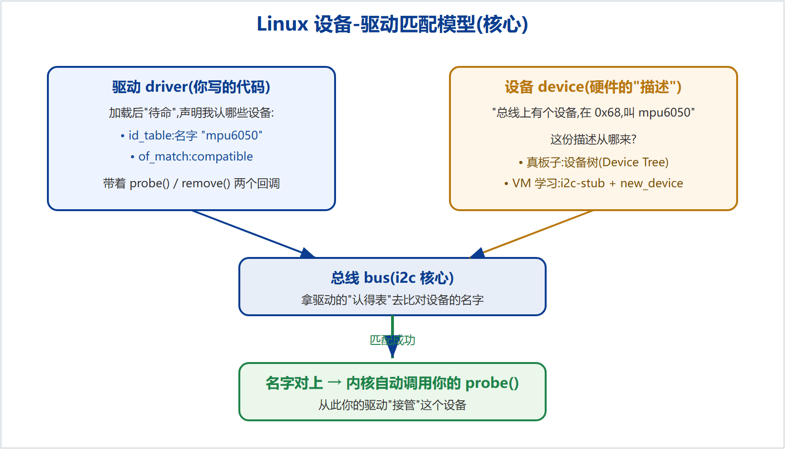
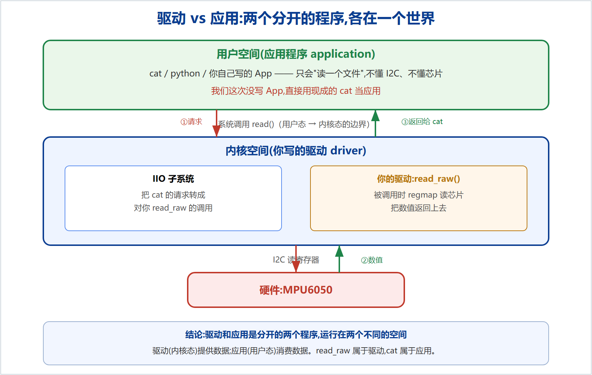

# 学习资料 · Linux 驱动入门知识梳理

这里是配合本仓库(MPU-6050 IIO 驱动)从零学习时整理的概念文档,面向**零基础**,按理解顺序排列。每份都有 PDF(可直接在线看)和 Word,`src/` 下是可复现的 HTML 源与矢量图。

## 推荐阅读顺序

| # | 文档 | 讲什么 |
|---|------|--------|
| 01 | [必备知识梳理-阶段一](01-必备知识梳理-阶段一.pdf) | 从内核模块到"设备-驱动匹配(待命→匹配→probe)"、i2c-stub 模拟,把第一阶段的地基串起来 |
| 02 | [入门知识体系](02-入门知识体系.pdf) | 正规的、从底层到框架的完整学习路线(阶段 0→7):模块 → 字符设备 → 硬件访问/并发 → 设备驱动模型 → 总线 → 框架子系统 → 调试工程 |
| 03 | [驱动到底要做什么](03-驱动到底要做什么.pdf) | 驱动的三件事(匹配/初始化/开接口)、"驱动是桥"、以及**驱动与应用的分工**(它们是分开的) |

## 两个最该先建立的心智模型

**① 设备-驱动匹配:驱动是"待命"的,内核发现匹配的设备才来敲你的 probe 门。**

**② 驱动 vs 应用是分开的:驱动(内核态)提供数据,应用(用户态,如 `cat`)消费数据。**

## 和本仓库代码的关系

- 本仓库 `drivers/iio/imu/mpu6050/` 是**生产级**成品驱动(多变体、FIFO、PM、事件、自检)。
- 这里的学习文档是**理解它、并从零手写一个最小版**所需的概念基础。
- 学习路线:先按 01→03 把概念打通 → 在 VM 上用 i2c-stub 从零手写(probe → regmap → WHO_AM_I → 注册 IIO → 通道 + read_raw,能 `cat` 出数据)→ 再回头读本仓库的生产级实现,一通百通。

## 源文件与复现

`src/0X/thesis.html` 是文档源,`src/0X/figures/` 是矢量图(`.svg`)与位图(`.png`)。
用 `src/build_thesis_docx.py`(生成带页码、嵌图的 Word)与 `src/cdp_pdf.py`(用 Edge DevTools 导出干净页码 PDF)可重新生成。
